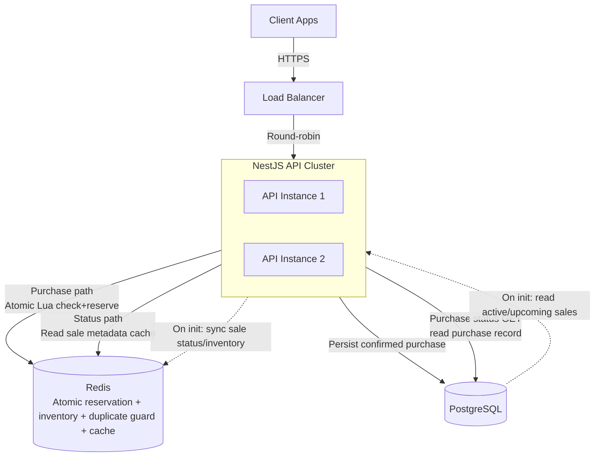

# Flash Sale API

A high-concurrency flash sale backend built with **NestJS**, **PostgreSQL**, and **Redis**. It handles simultaneous purchase attempts safely using atomic Redis Lua scripts, preventing overselling and duplicate purchases without database-level locks.

---

## Table of Contents

- [Design Choices and Trade-offs](#design-choices-and-trade-offs)
- [System Diagram](#system-diagram)
- [Prerequisites](#prerequisites)
- [Environment Setup](#environment-setup)
- [Running the Server](#running-the-server)
- [API Overview](#api-overview)
- [Running Tests](#running-tests)
- [Stress Tests](#stress-tests)

---

## Design Choices and Trade-offs

### Redis as the concurrency gate

All inventory state lives in Redis. A single atomic Lua script checks membership, reads the counter, and decrements in one round-trip — no race conditions are possible. PostgreSQL is only written to after Redis has confirmed the reservation.

### PostgreSQL as the source of truth

Redis is fast but not durable by default. Every confirmed purchase is persisted to PostgreSQL. If a DB write fails after a successful Redis reservation, the slot is immediately compensated (released back) to prevent inventory drift.

### Sale metadata cache

`GET /flash-sales/status` is the highest-read endpoint. The flash sale row is cached in Redis for 10 seconds to reduce PostgreSQL load. Inventory is **always** read fresh from the Redis counter, so the displayed remaining stock is never stale.

### Trade-offs

| Decision | Benefit | Trade-off |
|---|---|---|
| Redis Lua for atomicity | Zero oversell, no DB locks | Redis is a SPOF without replication |
| Metadata cache (10 s TTL) | Reduced DB reads at scale | Sale details can lag by up to 10 s after creation |
| TypeORM `synchronize: true` | Fast local development | Must switch to migrations before production |
| Single Redis node (dev) | Simple local setup | Add Redis Sentinel or Cluster for HA in production |
| Single PostgreSQL instance | Simpler operations and local setup | Add replicas/failover for HA and read scaling in production |
| Inline post-purchase persistence | After Redis reserves the slot, the API immediately writes the confirmed purchase to PostgreSQL in the same request, keeping the flow simple and the response deterministic | If payment, email, notifications, or other follow-up steps are added after purchase, move those side effects to a message queue so retries, failures, and downstream latency do not block or destabilise the purchase path |
| No API gateway in front of the service | Fewer moving parts and easier local development | For future production hardening, add an API gateway or edge layer to enforce per-IP rate limiting, bot protection, and other request filtering before traffic reaches the API cluster |

---

## System Diagram

### Infrastructure Components

[Backup architecture image](./architecture-design.png) if your Markdown viewer does not render the Mermaid chart.



---

## Prerequisites

- Node.js 20+
- npm 10+
- Docker and Docker Compose (for local PostgreSQL and Redis)

---

## Environment Setup

Copy the example variables and adjust if needed:

```bash
cp .env.example .env   # if provided, otherwise create .env manually
```

The `.env` file used for local development:

```env
PORT=3000

DB_HOST=localhost
DB_PORT=5432
DB_USERNAME=postgres
DB_PASSWORD=postgres
DB_DATABASE=flash_sale

REDIS_HOST=localhost
REDIS_PORT=6379

ADMIN_API_KEY=admin-api-key
```

Start the required infrastructure services:

```bash
docker-compose up -d
```

This spins up PostgreSQL on port `5432` and Redis on port `6379`. The database schema is created automatically on first startup via TypeORM `synchronize`.

Install dependencies:

```bash
npm install
```

---

## Running the Server

```bash
# development with watch mode
npm run start:dev

# standard start
npm run start

# production build
npm run build
npm run start:prod
```

The API is available at `http://localhost:3000`.  
Interactive Swagger docs are at `http://localhost:3000/api`.

To seed a flash sale, open `http://localhost:3000/api` or use Postman and call `POST /flash-sales` with the `x-api-key` header set to the `ADMIN_API_KEY` value from your `.env` file.

Example with `curl`:

```bash
curl -X POST http://localhost:3000/flash-sales \
  -H "Content-Type: application/json" \
  -H "x-api-key: admin-api-key" \
  -d '{
    "productName": "Limited Edition Sneakers",
    "price": 120,
    "salePrice": 79.99,
    "startTime": "2026-03-23T00:00:00.000Z",
    "endTime": "2026-03-23T23:00:00.000Z",
    "totalInventory": 100
  }'
```

---

## API Overview

| Method | Path | Auth | Description |
|---|---|---|---|
| `POST` | `/flash-sales` | `x-api-key` header | Create a flash sale |
| `GET` | `/flash-sales/status` | — | Get current sale status and remaining inventory |
| `POST` | `/purchases` | — | Attempt to purchase a flash sale item |
| `GET` | `/purchases/users/:userEmail?flashSaleId=` | — | Look up a user's purchase for a specific sale |

---

## Running Tests

```bash
# all unit tests (business logic)
npm run test:unit

# API endpoint integration tests (no DB or Redis required)
npm run test:integration

# full test suite
npm run test

# test coverage report
npm run test:cov
```

---

## Stress Tests

The stress tests simulate high volumes of concurrent purchase attempts entirely in-process using in-memory fakes for Redis and the database — no running infrastructure is needed.

```bash
npm run test:stress
```

### What the tests assert

**Test 1 — Inventory cap under load**

- 10,000 unique users attempt to purchase simultaneously
- Inventory is set to 120
- Expected: exactly 120 succeed, 9,880 are rejected with sold-out (status code: 410)

**Test 2 — Duplicate purchase prevention under retries**

- 1,000 unique users each fire 10 concurrent purchase requests (10,000 total)
- Inventory is set to 60
- Expected: exactly 60 succeed, the remaining 9,940 fail as a mix of duplicates (status code: 409) and sold-out (status code: 410)
- Expected: no user gets more than one successful purchase

### Why these results prove correctness

The atomic Redis Lua script (`SISMEMBER` → `GET` → `DECR` → `SADD`) is the single serialisation point. Even with thousands of concurrent coroutines, the script executes as a unit — no two requests can both read the same inventory value and both decrement it. The stress tests confirm that:

- Total confirmed purchases never exceed total inventory regardless of concurrency
- No user can hold more than one slot even when retrying aggressively
- DB-level unique constraints and Redis compensation work together to close any remaining gap
